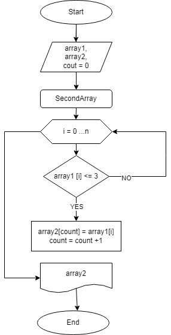

# Итоговая контрольная работа

> Задача.

> Написать программу, которая из имеющегося массива
строк формирует новый массив из строк, длина
которых меньше, либо равна 3 символам. 
Первоначальный массив можно ввести с клавиатуры
либо задать на старте выполнения алгоритма. При
решении не рекомендуется пользоваться
коллекциями, лучше обойтись исключительно
массивами.

### Алгоритм решения:

1. Объявляем два массива одинаковой длины.
2. Объявляем метод, в котором: цикл соразмерен длине массиваю
3. В цикле проверяем условие поставленной задачи: длина строки меньше, либо равна 3 символам.
4. Если условие верно, то элемент первого массива записывается во второго массива.
5. Переменная *count* поочередно перебирает элементы первого массива и записывает во второй массив, те элементы, которые соответствуют условию задачи.
6. Проверка будет продолжаться до тех пор, пока в первом массиве не закончатся элементы.

**Блок-схема решения задачи**

[Реализация алгоритма на языке C#](https://github.com/AlbinaHalf/FinalControl.git)
